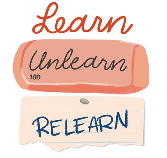

```{r, include = F}
# This is the recommended set up for flipbooks
# you might think about setting cache to TRUE as you gain practice --- building flipbooks from scratch can be time consuming
knitr::opts_chunk$set(fig.width = 6, message = FALSE, warning = FALSE, comment = "", cache = F)
library(flipbookr)
library(tidyverse)
library(here)
library(ggthemes)
library(glue)
library(ggrepel)


susp.green <- read.csv("Emerald Suspension data.csv")%>%
    arrange(reporting_category) %>%
    mutate(definition = fct_reorder(definition,reporting_category))

caaspp <- read.csv("CAASPP_5th_grade.csv")  %>%
    mutate(Students_Tested = as.numeric(Students_Tested),
           Percentage_Standard_Met_and_Above = as.numeric(Percentage_Standard_Met_and_Above),
           Mean_Scale_Score = as.numeric(Mean_Scale_Score),
           Total_CAASPP_Enrollment = as.numeric(Total_CAASPP_Enrollment),
           Percentage_Standard_Exceeded = 
             as.numeric(Percentage_Standard_Exceeded),
           Percentage_Standard_Met = 
             as.numeric(Percentage_Standard_Met),
           Percentage_Standard_Nearly_Met = 
             as.numeric(Percentage_Standard_Nearly_Met)) %>%
    filter(!is.na(Mean_Scale_Score),
           !is.na(Percentage_Standard_Met_and_Above),
           County_Code %in% c(1:6)) %>%
  mutate(County_Code = as.character(County_Code))

```


name: poppies
class: inverse, middle, bottom

background-image:url(img/MCOE-Logo.png), url(img/laurentiu-iordache-qstGMhWuORE-unsplash.jpg)
background-size: 10%, 100% 
background-position: 90% 90%, 50% 50%


# Demonstration Using ggplot
### VISUALIZATION PRINCIPLES IN PRACTICE
.large[David Dobrowski | Education Data Science Conference | 6 May 2021
ddobrowski@montereycoe.org]


```{r logo, fig.align = 'right', out.width = '20%' , echo=FALSE}
# knitr::include_graphics("img/MCOE Logo Transparent copy.png")

```


???

David Dobrowski

Monterey County Office of Education

Director of Data Research and Partnerships


Welcome

c - clone
p - presenter mode
t - timer


Going to be talking about ggplot which is part of the tidyverse

principles about vizualizations 


---

class: inverse, middle, center
name: title
# References for today

### Slides: https://ggplot-flipbook.netlify.app/ggplot-flipbook.html 

```{r  out.width = '20%' , echo=FALSE}


```

### Github repo: https://github.com/dobrowski/ggplotFlipbook

???

how to find these slides and github repo to play along at home

See also the earlier sessions by Oscar and Tyler ;  Ryan 


---

class: inverse, middle, center

```{r  out.width = '40%' , echo=FALSE}
knitr::include_graphics("img/BarbaraKrugerWhyAreYourHere.jpeg")

```

.right[
.small[Barbara Kruger]
]

???

Poll - How familiar are you with R and ggplot? 
- I just stayed from the last session and don't feel like moving
- I have dabbled but it isn't my go to tool
- I use them regularly and would like to learn something new
- I've led this presentation before

In chat, please write a question or something you hope to get out of today.  


I'm also ok with questions throughout, as well as at the end.  If it is something about R in general or an involved discussion, I may hold that until later. 

---
# Reasons Why to Graph Data

--

.large[Picture Superiority Effect]

--

```{r  out.width = '100%' , echo=FALSE}
knitr::include_graphics("img/picture-superiority-effect.jpeg")

```


???

Start with why are we visualizing data? 

Studies have shown that people remember things better when given a picture in addition to text or numbers


---
# Reasons Why to Graph Data

.center[

```{r dino, echo=FALSE}
knitr::include_graphics("img/DinoSequentialSmaller.gif")
```
]


.black[
.right[
.small[https://www.autodesk.com/research/publications/same-stats-different-graphs]
]]


???

Displaying visually allows use to see patterns we wouldn't necessarily get from summary statistics


---

# Components of a graph

???

ggplot's name comes from Hadley Wickham's Grammar of Graphics

His concept that there is an underlying grammar for creating visualizations and graphics. 

Everything we are going to do today is layering of additional elements are parts of speech.  

"The transferrable skills from ggplot2 are not the idiosyncracies of plotting syntax, but a powerful way of thinking about visualisation, as a way of mapping between variables and the visual properties of geometric objects that you can perceive."

--

## data 

???

In general this needs to be in  a tidy format.  each column is a varialbe each case is a row.   


--

### + 

--

## aesthetics

???

philosophically it is about the nature of beauty and appearance, 

here it is useful to think about how you are asking the computer to arrange things


--

### +

--

## geom 

???

These are the geometric shapes you want to use. 

For instance, lines, points, rectangles, maps, etc. 

These are the three components to creating a graph in ggplot, and arguable the grammar of graphing in any way even if not explicitly laid out.


---

# Components of a graph


--
.left[
### data - what you want to graph
]
--
.right[
### ggplot() +
]
--
.left[
### aesthetics - how the data elements are put into a graph
]
--
.right[
### aes() +
]
--
.left[
### geom - what geometric form of a graph you want
]
--
.right[
### geom_*  
]


---

# Graphing Elements

.pull-left[
```{r out.width = '75%', echo=FALSE }

```
]
.pull-right[
```{r out.width = '75%' , echo=FALSE }

```
]


.small[
.right[
https://socviz.co/index.html
]
]


???

These are building block of constructing a graph. Different ways to encode meaning, variables and data into geometric features. 


---
class: middle, center


```{r  out.width = '60%' , echo=FALSE}
knitr::include_graphics("img/ch-01-channels-for-cat-data-vertical.png")

```

.small[
.right[
https://socviz.co/index.html
]
]

???

Next we are going to go through a real example.  


Based on the state's research files.  

Only looking at all students, for ELA in Grade 5 in 2019.  
Filtered for only the first 6 county codes, so Alameda through Colusa

Using an approach called SLOWggplot.  Bit by bit.  
This isn't the way you would normally write the code but you can see each individual addition.

---

name: scatter

`r chunk_reveal("intro")`

```{r intro, include = FALSE}

# Comparing Percent Exceeded and Scale Score

library(ggplot2)  # Or tidyverse

caaspp %>% # pipe
ggplot() +
  # Add axis
  aes(y = Percentage_Standard_Exceeded) +
  aes(x = Mean_Scale_Score)  +
  # Define geometric shapes
  geom_point() +
  # Define more, optional aesthetics
  aes(shape = County_Code ) + 
  aes(color = County_Code ) +
  aes(size = Students_Tested) +
  # Alpha is transparency
  aes(alpha = Percentage_Standard_Met_and_Above) +
  # Repeating will override
  aes(color = Mean_Scale_Score) +
  # Defining any details like legend
  theme(legend.position = "none") 


```


???

Based on the state's research files.  

Only looking at all students, for ELA in Grade 5 in 2019.  
Filtered for only the first 6 county codes, so Alameda through Colusa

Using an approach called SLOWggplot.  Bit by bit.  
This isn't the way you would normally write the code but you can see each individual addition.


---

# Components of a graph


--
.left[
### data 
]
--
.right[
### CAASPP Data 
]
--
.left[
### aesthetics
]
--
.right[
### Which variables are x, y, color, shape, size, etc.
]
--
.left[
### geom
]
--
.right[
### A scatter plot 
]


???

We can go back to those there components that we discussed earlier and see how they were actualized in the graph we just made.  

---

name:barchart

`r chunk_reveal("bar")`

```{r bar, include = FALSE}


susp.green %>%
  # To reduce our dataset
  filter(reporting_category == "TA") %>% # All students
  ggplot( ) +
  aes(x = academic_year) +
  aes(y = as.numeric( suspension_rate_total)/100) +
  # A different geom than last time
  geom_col(position = "dodge" ) +
  # "dodge" uses the group 
  aes(group = school_name) +
  # Color is Outline
  aes(color = school_name) +
  # Fill is Inside color
  aes(fill = school_name) +
  # Adjust labels
    labs(title = "Percentage Suspended in Emerald High \ncompared to California over time") +
    labs(caption = "Source: https://www.cde.ca.gov/ds/sd/sd/filessd.asp") +
  theme(legend.position = "bottom") 

```


???

Looking at a real High School which there were concerns about suspension data

Start with a bar graph


---

name: line

`r chunk_reveal("first")`

```{r first, include = FALSE}


susp.green %>%
  filter(reporting_category == "TA") %>%
  ggplot( ) +
  aes(x = academic_year) +
  aes(y = as.numeric( suspension_rate_total)/100) +
  aes(group = school_name) +
  # New geom, same data
  geom_line( ) +
  aes(color = school_name) +
    labs(title = "Percentage Suspended in Emerald High \ncompared to California over time") +
    labs(caption = "Source: https://www.cde.ca.gov/ds/sd/sd/filessd.asp")

```


---

# Ease of modifcation and expansion

--

- Can tweak individual parts easily

--

- When making multiple graphs, only need to make change in one place

--

- Others can reproduce your steps


???

Image you made a graph that you liked.  Now imagine you have to do it for every school in your district or every school in the county.  Now for superintendent wants you to change the blue to light blue on every graph.  Now your colleague in San Diego wants to have it done for all of their schools.  

This is the power of using code to create the graphs and adaptability of ggplot. 


---

name: facet

`r chunk_reveal("facet")`

```{r facet, include = FALSE}


susp.green %>%
  # Notice, not filtering now 
  ggplot( ) +
  aes(x = academic_year) +
  aes(y = as.numeric( suspension_rate_total)/100) +
  # Faceting is not a geom
  facet_wrap(~definition) +
  aes(group = school_name) +
  geom_line( show.legend = FALSE ) +
  aes(color = school_name) +
  scale_color_manual(
    values =  c("#000000",  "#CC79A7")) +
  scale_y_continuous(
    labels = scales::label_percent(1)  ) +
  labs(title = "Percentage Suspended in Emerald High \ncompared to California over time") +
  labs(caption = "Source: https://www.cde.ca.gov/ds/sd/sd/filessd.asp") +
  labs(x = "Academic Year") + 
  labs(y = "Suspension Rate") +
  theme(axis.text.x = element_text(color=c(1,0,1,0))) + 
  theme_hc()

```


---

`r chunk_reveal("bar_revisit2", break_type = "rotate", widths = c(50,50))`

```{r bar_revisit2, eval = FALSE, echo = FALSE}


susp.green %>%
  filter(reporting_category == "TA") %>% 
  ggplot( ) +
  aes(x = academic_year) +
  aes(y = as.numeric( suspension_rate_total)/100) +
  geom_col(position = "dodge" ) +
  aes(group = school_name) +
  aes(color = school_name) +
  aes(fill = school_name) +
    labs(title = "Percentage Suspended in Emerald High \ncompared to California over time") +
    labs(caption = "Source: https://www.cde.ca.gov/ds/sd/sd/filessd.asp") + 
  theme_excel() + #ROTATE
  theme_economist() + #ROTATE
  theme_wsj() + #ROTATE
  theme_gdocs() +  #ROTATE
  theme_hc() + #ROTATE
  labs(x = "Academic Year")


```


???


Themes help you adjust many elements all together.  

Here are a few themes that mimic popular settings in the world


---

`r chunk_reveal("bar_revisit", break_type = "rotate", widths = c(50,50))`

```{r bar_revisit, eval = FALSE, echo = FALSE}


susp.green %>%
  filter(reporting_category == "TA") %>% 
  ggplot( ) +
  aes(x = academic_year) +
  aes(y = as.numeric( suspension_rate_total)/100) +
  geom_col(position = "dodge" ) +
  aes(group = school_name) +
  aes(fill = school_name) +
    labs(title = "Percentage Suspended in Emerald High \ncompared to California over time") +
    labs(caption = "Source: https://www.cde.ca.gov/ds/sd/sd/filessd.asp") + 
  scale_fill_colorblind() + #ROTATE
  scale_fill_gdocs() + #ROTATE
  scale_fill_few() + #ROTATE
  labs(x = "Academic Year")


```


???

Can easily change color palettes too


---

# Principle of Proportional Ink

--

### The sizes of shaded areas in a visualization need to be proportional to the data values they represent.

???

This is sometimes refered to as chartjunk.  

Think about it in terms of how do you help the viewer only think about what they need to and what is most important, and not trying to decipher your work.

--

### Eliminate clutter

--

### Focus attention


---

class: middle, center
# Graph Chooser

```{r  out.width = '50%' , echo=FALSE}
knitr::include_graphics("img/chooser.png")

```

http://experception.net/Franconeri_ExperCeptionDotNet_DataVisQuickRef.pdf


???

Can help determine the best graphs or geoms for your purpose. 

Not R specific. 


---

class: middle, center
# R Graph Gallery


```{r  out.width = '50%' , echo=FALSE}
knitr::include_graphics("img/gallery.png")

```

https://www.r-graph-gallery.com/


???

Particularly useful if you know what you want it to look like but not how to make that


---

# Book Resources

### Kieran Healy's Data Visualization: A practical introduction
https://socviz.co/index.html#preface

### Hadley Wickham's ggplot2:  Elegant Graphics for Data Analysis
https://ggplot2-book.org/index.html

### Many others:
https://bookdown.org/home/tags/visualization/


---

# When you get stuck

### Search StackOverflow

### Search R Community
https://community.rstudio.com/

---

class: middle, center

# Checklist 


```{r  out.width = '100%' , echo=FALSE}


```

https://stephanieevergreen.com/data-visualization-checklist/

???

Useful for thinking about clarity of your chart

---
class: middle, center


```{r  out.width = '60%' , echo=FALSE}


```


???

I want to hear from you.  Please put in the chat, or share outloud sometihng you learned, unlearned or relearned

learned - new 

unlearned - something you have been doing that you want to change or was 'wrong' 

relearned - a reminder of something from before


---
class: inverse

# Thanks: 

> **The flipbooked portion of this presentation was created with the {flipbookr} package.  Get it at remotes::install_github("EvaMaeRey/flipbookr")**

- In addition to creating flipbookr, Evangeline Reynolds inspired the approach to showing aspects of ggplot. https://evangelinereynolds.netlify.app/

- The formatting was learned and inspired from Allison Hill https://arm.rbind.io/slides/xaringan.html#1

- CAASPP data files: https://caaspp-elpac.cde.ca.gov/caaspp/ResearchFileList?ps=true&lstTestType=B&lstTestYear=2015&lstCounty=00&lstCntyNam=Select%20County...&lstFocus=btnApplySelections

- Suspension data files: https://www.cde.ca.gov/ds/sd/sd/filessd.asp
